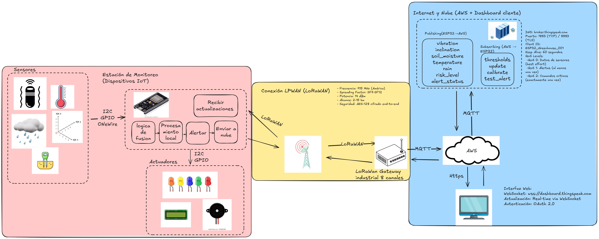

# Wiki - Sistema IoT de Monitoreo Temprano de Deslizamientos de Tierra

### integrantes
- Luis Mario Ramirez Muñoz -> Validator in Cisco Packet Tracer.
- Hector Jose Guzman Montaño -> (Designer)




## 1. Descripción del Proyecto

### Problema Identificado
El Internet de las Cosas (IoT) se refiere a la interconexión de dispositivos físicos mediante sensores, actuadores, y redes, permitiendo la recopilación y transferencia de datos sin intervención humana directa [1]. Protocolos ligeros de comunicación y arquitecturas eficientes son fundamentales para entornos con baja latencia y recursos limitados.

### Solución Propuesta
Sistema loT con conectividad LoRaWAN de largo alcance que monitorea vibración, inclinación, humedad del suelo, lluvia y temperatura en tiempo real, con algoritmo de fusión de datos y alertas automáticas mediante AWS IoT para detectar riesgo de deslizamientos.

En una arquitectura básica de MQTT, múltiples clientes se comunican a través de un único broker. El cliente puede publicar mensajes en tópicos específicos y otros clientes se suscriben para recibir esos mensajes, mientras que el broker se encarga de enrutarlos apropiadamente [2]. Este esquema facilita el diseño de sistemas escalables y es usado ampliamente en IIoT (Industrial IoT).

## 2. Diseño de Conectividad - Arquitectura Detallada

### 2.1 Capa de Dispositivos IoT (Estación de Monitoreo)

#### Sensores:
- **Vibration Switch** (Detección sísmica)
  - Protocolo: GPIO digital
  - Función: Conteo de activaciones por minuto
  - Umbral: >5 activaciones = emergencia
  
- **MPU6050** (Inclinación/Giroscopio)
  - Protocolo: I2C (0x68/0x69)
  - Función: Medición de inclinación del terreno
  - Rango: ±250°/s a ±2000°/s

- **YL-100** (Humedad del suelo)
  - Salida: ADC analógica
  - Rango: 0-100% humedad relativa
  - Umbral crítico: >70% saturación

- **DS18B20** (Temperatura ambiente)
  - Protocolo: OneWire
  - Rango: -55°C a +125°C
  - umbral: >10°C
  - Función: Detección de gradientes térmicos

- **Rain Detection Module** (Sensor de lluvia)
  - Salida: ADC analógica + digital
  - Rango: 0-1023 ADC
  - Umbral: >600 = lluvia torrencial

#### Actuadores:
- **LCD I2C** (Display de estado)
  - Protocolo: I2C (0x27/0x3F)
  - Función: Visualización de métricas en tiempo real
  
- **LEDs de estado** (Indicadores visuales)
  - Verde (Normal), Amarillo (Precaución), Naranja (Alerta), Rojo (Emergencia)
  
- **Buzzer piezoeléctrico** (Alertas sonoras)
  - Control: GPIO/PWM
  - Patrones diferenciados por nivel de riesgo

### 2.2 Microcontrolador y Comunicación

**ESP32 con Módulo LoRa**
- **Conectividad LoRaWAN**:
  - Frecuencia: 915 MHz (América)
  - Spreading Factor: SF7-SF12
  - Potencia: 14 dBm
  - Alcance: 2-15 km

### 2.3 Red LPWAN (LoRaWAN)

#### Características:
- **Topología**: Estrella
- **Protocolo**: LoRaWAN 1.0.4
- **Clase de dispositivo**: Clase A (bidireccional)
- **Activación**: OTAA (Over The Air Activation)
- **Seguridad**: AES-128 cifrado end-to-end

#### Gateway LoRaWAN:
- **Modelo**: Gateway industrial 8 canales [3]
- **Conectividad WAN**: Ethernet/4G LTE
- **Protocolo backhaul**: TCP/IP
- **Cobertura**: Radio de 10-15 km

### 2.4 Plataforma Cloud (AWS IoT)

#### Servicios AWS:
- **AWS IoT Core**: [4]
  - Broker MQTT: broker.thingspeak.com
  - Puerto: 1883 (TCP) / 8883 (TLS)
  - Client ID: ESP32_Greenhouse_001
  - Keep Alive: 60 segundos

#### Niveles QoS MQTT:
MQTT define tres niveles de calidad de servicio (QoS): 0 (al más rápido, sin garantía), 1 (garantía de que el mensaje llega al menos una vez), y 2 (exactamente una vez, evitando duplicados) [5]. La selección del QoS adecuado depende del compromiso entre latencia, ancho de banda, y fiabilidad requerida.

- QoS 0: Datos de sensores (best effort)
- QoS 1: Alertas (al menos una vez)  
- QoS 2: Comandos críticos (exactamente una vez)

#### Topics MQTT:
```
# Publishing (ESP32 → AWS)
landslide/station1/vibration
landslide/station1/inclination
landslide/station1/soil_moisture
landslide/station1/temperature
landslide/station1/rain
landslide/station1/risk_level
landslide/station1/alert_status

# Subscribing (AWS → ESP32)
landslide/station1/config/thresholds
landslide/station1/config/update
landslide/station1/control/calibrate
landslide/station1/control/test_alert
```

### 2.5 Capa de Aplicación (Dashboard Web)

**Interfaz Web**:
- **Protocolo**: HTTPS
- **Puerto**: 443
- **WebSocket**: wss://dashboard.thingspeak.com
- **Actualización**: Real-time vía WebSocket
- **Autenticación**: OAuth 2.0

## 3. Flujo de Datos End-to-End

```
1. ADQUISICIÓN:
   Sensores (Vibración, MPU6050, Lluvia, Humedad, Temperatura) → [GPIO/I2C/OneWire/ADC] → ESP32

2. PROCESAMIENTO LOCAL:
   ESP32 → Algoritmo de Fusión → Cálculo de Riesgo → Activación de Alertas Locales

3. TRANSMISIÓN REMOTA:
   ESP32 → [LoRa 915MHz] → Gateway LoRaWAN

4. BACKHAUL:
   Gateway → [TCP/IP] → Internet → [MQTT] → AWS IoT Core

5. PROCESAMIENTO CLOUD:
   AWS IoT Core → Rules Engine → Análisis histórico → DynamoDB/S3

6. VISUALIZACIÓN Y ALERTAS:
   AWS → [HTTPS/WebSocket] → Dashboard Web → Notificaciones Push

7. CONFIGURACIÓN REMOTA:
   Dashboard → AWS → [MQTT] → Gateway → [LoRaWAN] → ESP32 → Actualización de umbrales
```

## 4. Validación en Cisco Packet Tracer

//aca falta poner el diagrama que se hizo y eso

## 5. Ventajas de la Arquitectura LoRaWAN

### Comparación con WiFi tradicional:

| Característica | LoRaWAN | WiFi |
|---------------|----------|------|
| Alcance | 2-15 km | 100 m |
| Consumo energético | Ultra bajo | Alto |
| Penetración edificios | Excelente | Limitada |
| Costo infraestructura | Bajo | Medio |
| Escalabilidad | Miles de nodos | Cientos |

### Beneficios específicos:
- **Cobertura amplia**: Un gateway cubre múltiples estaciones de monitoreo en zonas montañosas
- **Batería**: Dispositivos pueden operar años con batería en ubicaciones remotas
- **Costo**: Sin necesidad de cableado o repetidores WiFi en terrenos difíciles
- **Confiabilidad**: Redundancia mediante múltiples gateways para zonas críticas
- **Penetración**: Excelente propagación en terreno montañoso y vegetación densa

### ¿por que MQTT?
 MQTT es más adecuado que CoAP o HTTP, permiten una comunicación eficiente y en tiempo real entre los dispositivos IoT, ademas el Broker central (AWS), ofrece niveles de Calidad de Servicio (QoS) para garantizar la fiabilidad en la entrega de datos de sensores y alertas. MQTT no genera una sobrecarga en el sistema, ya que no tiene un modelo de solicitud respuesta como HTTP y CoAP.


## 6. Seguridad Implementada

Al integrar IoT con tecnologías como LoRaWAN, es crucial asegurar tanto el canal de transmisión como los mecanismos de autenticación y cifrado. Por ejemplo, al usar MQTT sobre LoRaWAN, se deben considerar amenazas como intercepción de datos, suplantación de identidad, y ataques de enrutamiento/man-in-the-middle [6].

- **LoRaWAN**: Doble cifrado AES-128 (Network + Application)
- **MQTT/TLS**: Certificados X.509 para AWS IoT
- **Autenticación**: DevEUI + AppKey únicos por dispositivo
- **Integridad**: MIC (Message Integrity Code) en cada paquete
- **Anti-replay**: Contadores de frames

### Triada CIA (Confidencialidad, Integridad y Disponibilidad)

1) Confidencialidad
- Capa Dispositivo: Claves (AppKey/NwkKey) provisionadas por OTAA; almacenamiento en NVS del ESP32 con protección de flash encryption y secure boot habilitados.
- Capa Enlace: LoRaWAN AES-128 end-to-end; evitar ABP en producción; rotación de sesiones con rejoin.
- Capa Transporte: MQTT sobre TLS 1.2/1.3 con certificados X.509 por dispositivo y política de IAM restringida.
- Capa Aplicación: Minimizar payload (solo métricas necesarias); anonimización de identificadores de estación en telemetría pública.

2) Integridad
- LoRaWAN MIC y contadores de frame para detectar modificaciones y reenvíos.
- MQTT con QoS 1/2 para asegurar entrega y orden relativo; validación de esquema de mensaje en AWS (Rules/IoT Analytics/Lambda) con verificación de tipos y rangos.
- Firmas de firmware (ESP32 Secure Boot) para impedir cargas no autorizadas; hash SHA-256 de artefactos OTA.
- Controles de configuración: topics con autorización granular (pub/sub) y bloqueo de wildcards inseguros.

3) Disponibilidad
- ADR y selección de SF/Potencia para enlaces robustos; reintentos exponenciales y buffer local en ESP32 cuando el gateway/cloud no responde.
- Gateways redundantes y múltiples rutas de backhaul (Ethernet/4G) cuando sea posible.
- Políticas de retención en MQTT (last will/status) para detectar caídas; métricas de health-check publicadas periódicamente (ej. landslide/station1/status).
- Energía: batería con respaldo y modo low-power; watchdog en ESP32 y auto-reboot en fallas; ventanas de reporte degradadas durante emergencias para priorizar alertas.

## 7. retos

LoRaWAN, como una tecnología LPWAN, está diseñada para ofrecer cobertura de largo alcance con bajo consumo energético, lo que la hace adecuada para aplicaciones masivas de IoT. Sin embargo, enfrenta desafíos significativos cuando el número de dispositivos conectados crece mucho: interferencias entre señales, colisiones de transmisiones, limitaciones de los canales físicos, asignación del factor de dispersión (Spreading Factor, SF), y requisitos de adaptabilidad en la tasa de transmisión revisar como lo solucionan acá[7].


## 8. Referencias

[1] N. Gwangwava and T. B. Mubvirwi, “Design and Simulation of IoT Systems Using the Cisco Packet Tracer,” *Advances in Internet of Things*, vol. 11, no. 2, pp. 59-76, Apr. 2021. doi: 10.4236/ait.2021.112005. Available: https://www.scirp.org/journal/paperinformation?paperid=108495

[2] Dr. Andreas Schiffler, “MQTT Architecture Explained: Guide for Industrial IoT Networks,” blog-Paessler, Aug. 25, 2025. Available: https://blog-paessler-com.translate.goog/understanding-mqtt-architecture?_x_tr_sl=en&_x_tr_tl=es&_x_tr_hl=es&_x_tr_pto=tc

[3] Lansitec, “Outdoor LoRaWAN Gateway (8 canales) – Lansitec,” [Producto web]. Available: https://www.lansitec.com/es/products/outdoor-lorawan-gateway

[4] Amazon Web Services, “AWS IoT Core,” AWS. Available: https://aws.amazon.com/es/iot-core

[5] HiveMQ, “What is MQTT Quality of Service (QoS) 0,1, & 2? – MQTT Essentials: Part 6,” HiveMQ blog. Available: https://www.hivemq.com/blog/mqtt-essentials-part-6-mqtt-quality-of-service-levels

[6] CyberArk, “LoRaWAN & MQTT: What to Know When Securing Your IoT Network,” Threat Research Blog. Available: https://www.cyberark.com/resources/threat-research-blog/lorawan-mqtt-what-to-know-when-securing-your-iot-network


[7] Mohammed, Nasir, Mohamed-Slim, El Mehdi  , “A Survey on Scalable LoRaWAN for Massive IoT:Recent Advances, Potentials, and Challenges” arXiv preprint arXiv:2202.11082, 2023. Available: https://arxiv.org/pdf/2202.11082

